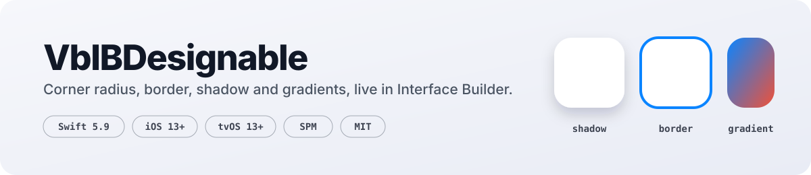
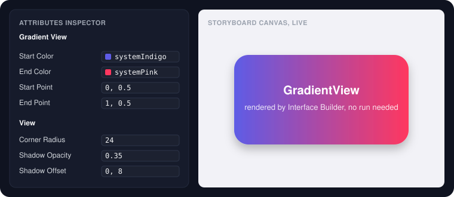

<div align="center">

<picture>
  <source media="(prefers-color-scheme: dark)" srcset="docs/banner-dark.svg" />
  
</picture>

<br />

[](https://github.com/vbhvsingh/VbIBDesignable/actions/workflows/ci.yml)
[](Package.swift)
[](Package.swift)
[](#install)
[](LICENSE)
[](https://github.com/vbhvsingh/VbIBDesignable/tags)

Set corner radius, border, shadow and gradients from the **Attributes Inspector** and see them rendered in the storyboard.
No code, no `layoutSubviews` override, no dependencies.

</div>

<br />

<p align="center">
  
</p>

## Why

UIKit keeps the interesting `CALayer` properties out of Interface Builder. Every project ends up with the same `UIView` extension pasted in, and every gradient view ends up with a sublayer that has to be resized by hand. This package is that extension done once, plus gradient views that are backed by `CAGradientLayer` directly, so they follow Auto Layout and rotation with nothing to resize.

## Install

**Xcode**: File → Add Package Dependencies, then paste

```
https://github.com/vbhvsingh/VbIBDesignable
```

**Package.swift**

```swift
dependencies: [
    .package(url: "https://github.com/vbhvsingh/VbIBDesignable", from: "1.0.0")
],
targets: [
    .target(name: "MyApp", dependencies: ["VbIBDesignable"])
]
```

## What you get

### Every `UIView`, in the inspector

Add `import VbIBDesignable` anywhere in the target and these appear in the Attributes Inspector for any view in a storyboard or XIB:

| Property | Type | Backed by |
|---|---|---|
| `cornerRadius` | `CGFloat` | `layer.cornerRadius` |
| `masksToBounds` | `Bool` | `layer.masksToBounds` |
| `borderWidth` | `CGFloat` | `layer.borderWidth` |
| `borderColor` | `UIColor?` | `layer.borderColor` |
| `shadowRadius` | `CGFloat` | `layer.shadowRadius` |
| `shadowOpacity` | `Float` | `layer.shadowOpacity` |
| `shadowOffset` | `CGSize` | `layer.shadowOffset` |
| `shadowColor` | `UIColor?` | `layer.shadowColor` |

They are ordinary properties, so they work from code too:

```swift
import VbIBDesignable

card.cornerRadius = 16
card.shadowColor = .black
card.shadowOpacity = 0.15
card.shadowOffset = CGSize(width: 0, height: 6)
card.shadowRadius = 12
```

> **Shadow and corner radius together.** A shadow needs `masksToBounds` off, so keep it off on the view that draws the shadow and put clipped content in a subview.

### `GradientView` and `GradientButton`

Set the custom class in the Identity Inspector, then pick `startColor`, `endColor`, `startPoint` and `endPoint` in the Attributes Inspector. Points are in unit space, so `(0, 0.5)` to `(1, 0.5)` is left to right and `(0, 0)` to `(1, 1)` is diagonal.

```swift
let header = GradientView()
header.startColor = .systemIndigo
header.endColor = .systemPink
header.startPoint = CGPoint(x: 0, y: 0)
header.endPoint = CGPoint(x: 1, y: 1)

let cta = GradientButton(type: .system)
cta.setTitle("Continue", for: .normal)
cta.startColor = .systemBlue
cta.endColor = .systemTeal
cta.cornerRadius = 14
```

Both classes are `open`, so subclass them if you need more.

## How it works

- The `UIView` extension is a thin `@IBInspectable` bridge to `layer`. No swizzling, no stored state.
- `GradientView` and `GradientButton` override `layerClass` to return `CAGradientLayer`. The gradient **is** the view's layer, so it is always the right size and nothing is inserted on redraw.
- `prepareForInterfaceBuilder()` applies the colours, which is what makes the storyboard canvas render the gradient live.

## Requirements

| | Minimum |
|---|---|
| Swift | 5.9 |
| iOS | 13.0 |
| tvOS | 13.0 |
| Xcode | 15 |

## Contributing

Issues and pull requests are welcome. Keep the package dependency free and keep every property `@IBInspectable`.

## License

MIT. See [LICENSE](LICENSE).

<br />

<div align="center">
Built by <a href="https://github.com/vbhvsingh">Vaibhav Singh</a> · <a href="https://heylabs.in">HeyLabs</a>
</div>
